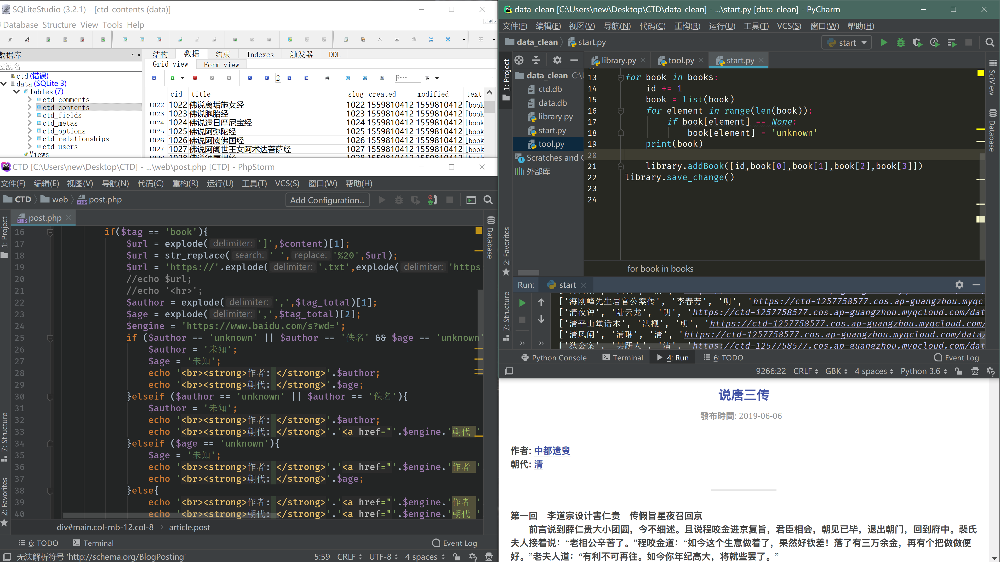

# 中国古籍网

**Chinese Traditional Book Database**

[ctd.overfit.org](http://ctd.overfit.org)

一个纯净的中国古籍网，build only for love~~


**Build：**

+ 使用 typecho + 原主题 为基础制作，并加以改进

+ 数据库选用SQLite，因为虚拟主机商给的数据库空间不多

+ 文件中以 `data_` 开头的均为数据处理的文件
+ 分布式存储，数据文件和页面文件分开储存


**Warning:**

虽然这是一个公益项目，但还是请不要滥用我提供的数据资源以及放孤儿爬虫，如果你需要数据库，给我说声就行了


**Contribute：**

有什么还点子，欢迎pull request

手上有古籍资源？请给我说声。


**Rules for database:**

数据库类型为 SQLite

数据库的架构和 typecho SQLIite 版本相同

`ctd_contents` 包含了网站所有的书籍数据

如果你不想操作数据库，你也可以用 `library_sql\library.py` 脚本来添加数据

网站资源有四种种类型：

1. book
2. poem
3. download
4. 其他

对于每一个类型，数据添加的规则都不同，以下写几个sample：

1. book 类型资源：

```python
import library

# 实例化
library = library.library()

# 构建数据
tag = 'book' # book 类型的医院添加
id = 1 # 书的id（每本的id必须不一样）
book_name = '赛尔号传说' # 书名
book_author = 'chester' # 书作者
book_age = '现代' # 书的年代
book_link = 'https://sample.com/saierhao.txt' # 需要是书的txt链接


data = [id,book_name,book_author,book_age,book_link]

# 加入数据库
library.addMethod(data)

# 保存变化
library.save_change()
```

2. 其他类型的添加方法：

```txt
# book_information: 
[id,book_name,book_author,book_age,book_link]

# poem_information: 
[id,poem_name,poem_author,poem_age,poem_content]

# download_information: [id,file_name,file_author,file_age,file_describe,file_download_link]
```


当然，如果你想增加网站对文件数据的支持的话，修改 `web/post.php` 文件就可以了，sample如下：

```php
            }elseif ($tag == 'download'){
                $author = explode(',',$tag_total)[1];
                $age = explode(',',$tag_total)[2];
                $describe = explode(',',$tag_total)[3];

                $engine = 'https://www.baidu.com/s?wd=';
                echo_author_and_age($author,$age,$engine);

                echo '<hr>';

                echo '<h2>書籍描述：</h2>';
                if($describe == 'unknown'){
                    echo  '<br><strong>描述: </strong>' .'未知';
                }else{
                    echo '<br><strong>描述: </strong>' . $describe;
                }
```


**Code:**

楼主还是个学生，第一次建网站，也是第一次用php做项目，所以如果代码有什么不做的地方，也请见谅

↓ 纪念下编码历程：



