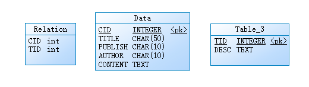

# Usage
```python
import CTD

# New a instance
ctd_db = CTD.CTD()

# data structure
data = [
    {
    "title": "book title",
     "author": "book author",    # Set as "NULL" if no info
     "content": "content of the book",
     "type": "book type",
     "publish": "when publish"   # Set as "NULL" if no info
    }  
]

# push data to database
ctd_db.push(data)

# get length
print(ctd_db.length())

# save and close
ctd_db.commit()
ctd_db.close()

# reconnect
ctd_db.connect()

```

## Database


